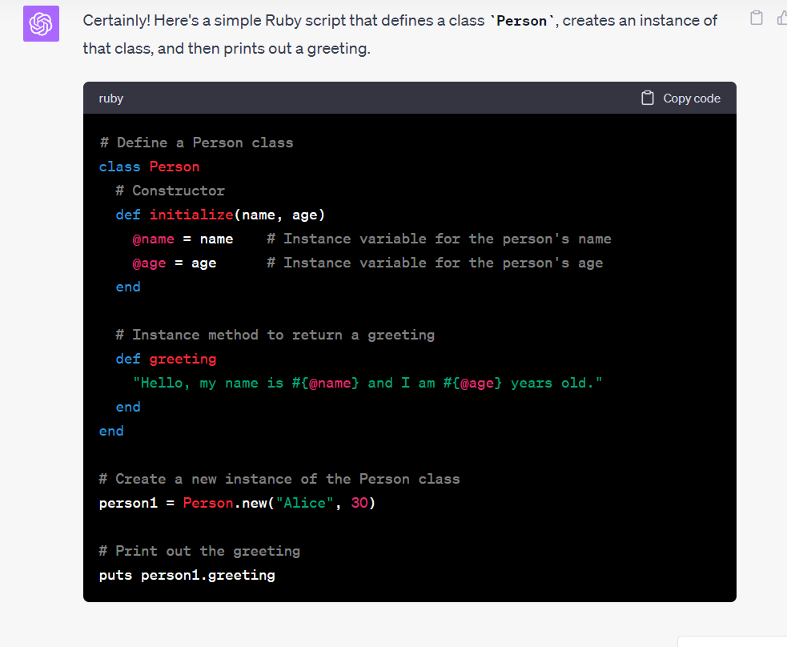

# Writing Good Documentation

## Step 1 - Using Codeblocks.

Codeblocks in markdown make it *very easy* for tech people to **copy, paste, share** code.
A good __Cloud Engineer__ uses Codeblocks whenever possible.

Because it allows others to copy and paste their code to replicate or research issues.


- In order to create codeblocks in markdown you need to use three backticks (`)
- Not to be confused with qoutation (')

```
# Define a Person class
class Person
  # Constructor
  def initialize(name, age)
    @name = name    # Instance variable for the person's name
    @age = age      # Instance variable for the person's age
  end

  # Instance method to return a greeting
  def greeting
    "Hello, my name is #{@name} and I am #{@age} years old."
  end
end
```

- When you can you should attempt to apply syntax highlighting to your codeblocks

```ruby
# Define a Person class
class Person
  # Constructor
  def initialize(name, age)
    @name = name    # Instance variable for the person's name
    @age = age      # Instance variable for the person's age
  end

  # Instance method to return a greeting
  def greeting
    "Hello, my name is #{@name} and I am #{@age} years old."
  end
end
```

- Make note of where the backtick keyboard key is located.
- It should appear above the tab key, 
- but it may vary based on your keyboard layout.


Good Cloud Engineers use codeblocks for both Code and Errors that appear in the console.


```bash
Traceback (most recent call last):
        2: from /usr/bin/irb:23:in `<main>'
        1: from (irb):1
RuntimeError: This is a custom error message
```

> Here is an example of using a codeblock for an error that appears in bash.

When you can always provide a codeblock instead of a screenshot.
If you need to take a screenshot make sure it nots a photo from your phone.

> There are certain cases where its okay to take photos with your phone. This is when you are showing something like a keyboard, which does not appear on a computer screen. If it render on your computer screen it should be a screenshot.

## Step 1 - How to take screenshots

A screenshot is when you capture a part of you screen from your laptop, desktop or phone.

This is not be confused with take a photo with your phone.

**DON'T DO THIS**


This is what a screenshot from your computer should look like

**DO THIS INSTEAD**



To take screenshots on both macOS and Windows, you can use the following hotkeys:

**For macOS:**

1. **Entire Screen:** 
   - Press `Command (⌘) + Shift + 3`
   - The screenshot will be saved to your desktop by default.

2. **Selected Portion:**
   - Press `Command (⌘) + Shift + 4` 
   - Drag to select the area of the screen you want to capture.
   - The screenshot will be saved to your desktop by default.

3. **Capture a Window:** 
   - Press `Command (⌘) + Shift + 4`, then press `Spacebar`.
   - Click on the window you want to capture.
   - The screenshot will be saved to your desktop by default.

4. **Capture Touch Bar (if you have one):**
   - Press `Command (⌘) + Shift + 6`
   - The screenshot will be saved to your desktop by default.

**For Windows:**

1. **Entire Screen:** 
   - Press `PrtScn` (Print Screen) key.
   - The screenshot is copied to the clipboard. You can paste it into an application like Paint or Word.

2. **Active Window:** 
   - Press `Alt + PrtScn`
   - The screenshot of the active window is copied to the clipboard. You can paste it into an application.

3. **Selected Portion using Snip & Sketch (available in recent Windows versions):**
   - Press `Windows + Shift + S`
   - Your screen will dim, and you can select an area to capture.
   - The screenshot is copied to the clipboard. You can paste it into an application.

4. **Using Snipping Tool (available in older Windows versions):**
   - Search for "Snipping Tool" in the start menu.
   - Open the application and click on "New" to take a screenshot.
   - Save the screenshot.

For both operating systems, there are also third-party applications available that offer more advanced screenshot functionalities, but the above methods are built-in and don't require additional software.


## Step 3 - Use Github Flavoured Markdown Task Lists

Github extends Markdown to have a list where you can check off items. [<sup>[1]</sup>](#external-references)

- [x] Finish Step 1
- [ ] Finish Step 2
- [x] Finish Step 3

# Step 4 - Use Emojis (Optional)

GitHub Flavored Markdown (GFM) supports emoji shortcodes.
Here are some examples:

| Name | Shortcode | Emoji |
| --- | --- | --- |
| Cloud | `:cloud:` | :cloud: |
| Cloud with lighting | `:cloud_with_lighting` | 🌩️ |

[Photo of the pipe character on our board](asset/pipe-chart.jpg)

[Secret Window Hidden Garden](secret-window/hidden-garden.md)

## External References

- [GitHub Flavored Markdown Spec](https://github.github.com/gfm/)
- [Basic writing and formatting syntax (Github Flavored Markdown)](https://docs.github.com/en/get-started/writing-on-github/getting-started-with-writing-and-formatting-on-github/basic-writing-and-formatting-syntax#quoting-text) 
- [GFM - Tasks Lists](https://docs.github.com/en/get-started/writing-on-github/getting-started-with-writing-and-formatting-on-github/basic-writing-and-formatting-syntax#task-lists)  <sup>[1]</sup>
- [GFM - Emoji CheatSheet](https://github.com/ikatyang/emoji-cheat-sheet)
- [GFM - Tables (with extensions)](https://github.github.com/gfm/#tables-extension-) <sup>[2]</sup>


